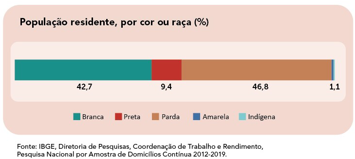

# Reprograma_Projeto Livre Final_Negritude em Ação

<center><Logo com o nome do projeto com fundo preto dentro de um quadrado que muda as cores da borda entre azul e brando></center>

<center><h1>Profissionais Negres de Diversas Áreas em um só Lugar!</h1></center>

 Banco de Dados que reúne profissionais negres de diversos campos de atuação e localidades.

 Status: **Banco de Dados em alimentação contínua.** 

O que você encontra aqui:
=================
<!--ts-->
   * [Apresentação](#Apresentação)
   * [Contextualizando](#Contextualizando)
   * [Sobre a População Brasileira](#Sobre-a-População-Brasileira)
   * [Documentação](#Documentação)
   * [Tecnologias Utilizadas](#Tecnologias-Utilizadas)
      * [Comandos de Inicialização](#Comandos-de-inicialização) 
      * [Dependências](#Dependências)
   * [Rotas da API](#Rotas-da-API)
   * [Testes](#testes)
   * [Se liga nas dicas](#Se-liga-nas-dicas)
   * [Referências](#Referências)
<!--te-->

<h2>Apresentação</h2>

O **Negritude em Ação** é o projeto final do curso de Desenvolvimento Web em Back-End realizado pelo ***bootcamp*** da [Reprograma](https://reprograma.com.br/) em parceria com o [Projeto M.I.N.As/Porto Digital](https://www.portodigital.org/capital-humano/iniciativas-para-a-diversidade/mulheres-em-inovacao-negocios-e-artes-minas). Este projeto consiste na criação de uma API gerenciadora de um banco de dados que reune informações sobre profissionais heteroidentificados como negros(pretos e pardos). Não há distinção de campo de atuação porfissional, muito menos localidade. Conforme os dados são captados, seguem sendo inseridos no banco. 

O propósito aqui é de que pessoas que desejem, se sintam confortáveis ou até que prefiram atendimento por profissionais negres e tenha dificuldades em encontrá-los, possa ter este problema resolvido.  

<h2>Contextualizando</h2>

Sabe-se que história dos negros no Brasil é permeada pela escravização de povos vindos do continente africano, estupro por meio de reprodução forçada e muito trabalho pesado não remunerado. Com a abolição da escravatura, os negros foram jogados nas ruas sem trabalho. Sem condições para viver, ocuparam as áreas marginalizadas das cidades. Além do fato, de terem sido inferiorizados e discriminados, durante muitos anos, esta parcela da população não teve condições para se profissionalizar e ocupar vagas de emprego melhores.

Apesar de a mudança ser lenta, mediante tantos anos de história, mais negros estão conseguindo se qualificar. No entanto, ainda é difícil encontrar tais profissionais sem que se faça uma busca minuciosa. Neste sentido, objetiva-se com este banco de dados reunir o máximo de profissionais negros, facilitando o acesso aos diversos públicos e permitindo ampliar a divulgação de tais profissionais e seus trabalhos.

<h2>Sobre a População Brasileira</h2>

O IBGE pesquisa a cor ou raça da população brasileira com base na autodeclaração. Ou seja, as pessoas são perguntadas sobre sua cor de acordo com as seguintes opções: branca, preta, parda, indígena ou amarela. De acordo com dados da Pesquisa Nacional por Amostra de Domicílios (PNAD) 2019, 42,7% dos brasileiros se declararam como brancos, 46,8% como pardos, 9,4% como pretos e 1,1% como amarelos ou indígenas.

De acordo com dados da Pesquisa Nacional por Amostra de Domicílios (PNAD) 2019, 42,7% dos brasileiros se declararam como brancos, 46,8% como pardos, 9,4% como pretos e 1,1% como amarelos ou indígenas.

<center></center>

Raça é um termo que não possui o mesmo significado para todas as pessoas e sua definição depende, em grande parte, do motivo pela qual é avaliada. O que faz um indivíduo pertencer a determinado grupo racial varia de acordo com a época e a região do mundo em que ele vive e com os interesses políticos e culturais em classificá-lo em um determinado grupo (Alves et al, 2005). Isso não acontece só quando o classificam, mas também quando ele declara sua própria raça. Segundo Cavalli-Sforza (2003), qualquer classificação racial é arbitrária, imperfeita e difícil. Poderíamos dizer que se trata de uma questão extremamente polêmica e com nuances de subjetividade. O Censo 2010 detectou mudanças na composição da cor ou raça declarada no Brasil. Dos 191 milhões de brasileiros em 2010, 91 milhões se classificaram como brancos, 15 milhões como pretos, 82 milhões como pardos, 2 milhões como amarelos e 817 mil como indígenas. Registrou-se uma redução da proporção de brancos, que em 2000 era 53,7% e em 2010 passou para 47,7%, e um crescimento de pretos (de 6,2% para 7,6%) e pardos (de 38,5% para 43,1%). Sendo assim, a população preta e parda passou a ser considerada maioria no Brasil (50,7%). 

<h2>Documentação</h2>

1. [NodeJs](https://nodejs.org/en/docs/)
2. [NPM](https://docs.npmjs.com/)
3. [Git](https://git-scm.com/doc)
4. [Bash](https://www.atlassian.com/git/tutorials/git-bash)
5. [MongoDB](https://docs.mongodb.com/)
6. [Robo 3T](https://robomongo.org/download)

<h2>Tecnologias utilizadas</h2>   

Para este projeto inicializar, você precisará ter instalado em sua máquina:

1. Node.js(versão igual ou superior a v12.18.3);
2. MongoDB(Para facilitar a visualização dos dados no banco, pode usar o Robo3T);
3. Controle de versionamento(Git);
4. IDE-Ambiente de desenvolvimento integrado(Visual Studio Code).

<h3>Comandos de Inicialização</h3>

Após ter feito o fork e clone deste [repositório](https://github.com/eline-create/projetoFinal.git) em sua máquina para que o pacote node-modules fique ativo e você consiga utilizar todas as depências instaladas, você deve escrever no seu terminal, o comando:

```
npm install
```
Para executar a aplicação pelo terminal, use o comando:

```
npm star
```
O servidor iniciará na porta:5002

Caso queria começar do início e apenas se guiar por aqui, lembre-se de usar o npm init, antes de instalar as depêndencias a serem utilizadas.

<h3>Dependências</h3>

Estas foram as depências utilizadas. Os procedimentos de instalação contam na documentação NPM de cada uma. Lembrando que a instalação só será necessária caso não queira iniciar um arquivo do zero. Para isso não esqueça do comando **npm init** antes de começar a instalas as mesmas.

1. bcrypt
2. dotenv-safe
3. express
4. jsonwebtoken
5. mongoose 
6. nodemon

<h2>Rotas da API</h2>

A API está sendo escutada pela porta 5002, para as rotas serem acessadas localmente, faz-se necessário usar o endereço: http://localhost:5002/. Após a barra, é necessário acrescentar os caminhos do que se deseja acessar(Ver a coluna recursos dos quadros a seguir).
Importante saber: É possível que em outra máquina a porta esteja sendo utilizada em outro aplicação. Basta alterar para outra como: 3000, 8000, 8080, 8083.

Para alimentar o banco de dados, a API foi dividida em duas collections: A primeira destina-se a coletar as informações necessárias ao cadastro dos profissionais, contendo atributos como nome, área de atuação, localidade. Já a segunda, refere-se às administradoras do banco de dados.

No intuito de garantir a segurança dos dados coletados e sua manipulação restrita, apenas as rotas que retornam listas, ou seja, aquelas do método GET que não faz qualquer alteração dos dados, não necessitam de **_token_** de autorização, para as demais a autorização e autenticação são exigidas.

## Profissionais

---
| Verbo    | Método     | Recurso              | Descrição                                       |
| -------- | ---------- | -------------------- | ----------------------------------------------- |
| 1.POST   | createNew  | `/profissionais`     | Cadastrar novo profissional                     |
| 2.GET    | selectAll  | `/profissionais`     | Retornar todos os profissionais cadastrados     |
| 3.PUT    | updateById | `/profissionais/:id` | Substituir/Atualizar informações de um registro |
| 4.DELETE | deleteById | `/profissionais/:id` | Excluir um cadastro específico                  |
---

---
| Verbo | Método          | Recurso                           | Descrição                                               |
| ----- | --------------- | --------------------------------- | ------------------------------------------------------- |
| 1.GET | selectById      | `/profissionais`                  | Retornar um profissional por id                         |
| 2.GET | selectByName    | `/profissionais/name/:name`       | Retornar um profissional por nome                       |
| 3.GET | selectBySubarea | `/profissionais/subarea/:subarea` | Retornar os profissionais por área e subárea de atuação |
| 4.GET | selectByAddress | `/profissionais/city/:city`       | Retornar um profissional pelo local de atuação          |
| 5.GET | filterAdm       | `/profissionais/admId/:admId`     | Retornar os profissionais cadastrados por cada Adm.     |
---

## Administradoras

---
| Verbo    | Método    | Recurso                  | Descrição                                  |
| -------- | --------- | ------------------------ | ------------------------------------------ |
| 1.GET    | createNew | `/administradoras`       | Cadastrar nova administradora              |
| 2.POST   | selectAll | `/administradoras`       | Retorna as administradoras cadastradas     |
| 3.POST   | login     | `/administradoras/login` | Acesso ao banco pelas administradoras      |
| 4.PUT    | update    | `/administradoras/:id`   | Atualizar o cadastro de uma administradora |
| 5.DELETE | delete    | `/administradoras/:id`   | Exclui uma administradora cadastrada       |
---

<h2>Testes</h2>

Para testar a API em alguma ferramenta de testes e desenvolvimento de APIs, você pode fazer download das rotas organizadas através deste [link](https://www.getpostman.com/collections/3933ec0a5006252b83dd) do Postman. Não esqueça de configurar a porta/host que estará sendo usada no seu computador.

O deploy do projeto foi feito no Heroku. Você pode encontrar através do link [Projeto Final](https://projetofinal-reprograma.herokuapp.com/) no Heroku.Esse link te levará ao index. 


<h2>Se liga nas dicas</h2>

1. Caso queira saber como fechar uma porta em uso ou descobrir se ela está sendo utilizada, é possível através deste [link](https://medium.com/@daniloassis.ti/como-finalizar-um-processo-em-aberto-no-windows-525652152902);
2. Para gerar a chave privada, pode usar esse [site](https://travistidwell.com/jsencrypt/demo/);
3. Para fazer um bom readme com o [Rocketseat](https://blog.rocketseat.com.br/como-fazer-um-bom-readme/#Sobre);
4. Comandos utéis do Git [Git - comandos utéis](https://gist.github.com/leocomelli/2545add34e4fec21ec16)


### Referências:

1. Como identificar uma porta HTTP. Disponível em: https://medium.com/@daniloassis.ti/como-finalizar-um-processo-em-aberto-no-windows-525652152902. Acesso em 28/11/2020.
2. Estudos sobre cor e raça. Disponível em: https://agenciadenoticias.ibge.gov.br/agencia-sala-de-imprensa/2013-agencia-de-noticias/releases/14057-asi-ibge-divulga-resultados-de-estudo-sobre-cor-ou-raca. Acesso em 28/11/2020.
3. LAMARCA, Gabriela & VETTORE, Mario. A nova composição racial brasileira segundo o Censo 2010. Disponível em: http://dssbr.org/site/2012/01/a-nova-composicao-racial-brasileira-segundo-o-censo-2010/. Acesso em 11/12/2020.
4. Sobre a População Brasileira. https://educa.ibge.gov.br/jovens/conheca-o-brasil/populacao/18319-cor-ou-raca.html Acesso em 28/11/2020.
5. Sobre o uso da linguagem neutra. Disponível em: https://guiadoestudante.abril.com.br/atualidades/linguagem-neutra-bobagem-ou-luta-contra-a-discriminacao/. Acesso em 10/12/2020.
6. Sobre heteroidentificação. Editora Lex Magister. Disponível em: http://www.lex.com.br/legis_27634767_PORTARIA_NORMATIVA_N_4_DE_6_DE_ABRIL_DE_2018.aspx. Acesso em 11/12/2020.
 

### Autora
---

<a href="https://github.com/eline-create">
 
 <br />
 <sub><b>Eline Pimentel</b></sub></a> 


Feito com ❤️ por Eline Pimentel 

[](https://www.linkedin.com/in/eline-silva-de-paula-pimentel/) 
